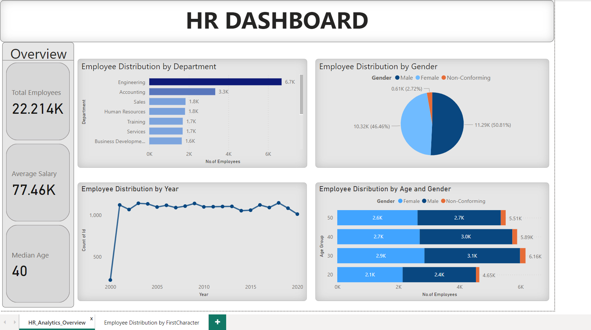
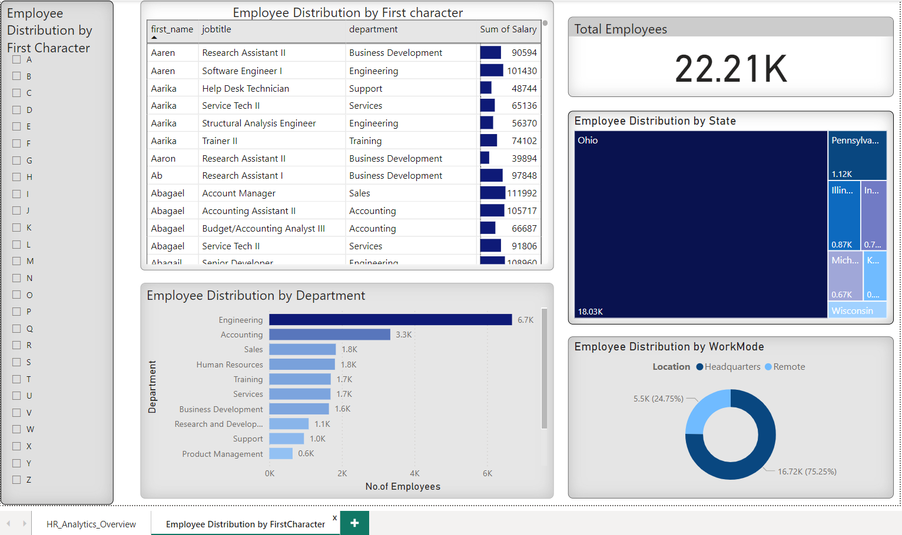

# HR-Data-Analytics
# HR DATA ANALYSIS - SQL SERVER 2022 / POWER BI
This project delves into data analysis using SQL and Power BI to uncover valuable human resource insights that can significantly benefit the company. It features eye-catching dashboards that provide essential HR metrics such as employee turnover, diversity, recruitment effectiveness, and performance evaluations. These insights enable HR professionals to make informed decisions and support strategic workforce planning.
## Data Cleaning & Analysis:
Utilized SQL Server 2022 to conduct comprehensive data analysis on a 22,000-record HR dataset spanning 20 years.
- Data loading & inspection, data cleaning
- including handling missing values and inconsistencies, to ensure data quality and accuracy.
# Exploratory Data Analysis
## Questions:

- Total Number of employees in the company?
- Average Salary of the Employees?
- What is the median age of employment in the company?
- What is the Employee Distribution by Company?
- What is the gender breakdown in the company?
- What is the age distribution vs Gender in the company?
- Employee Distribution over time Spanning for 20 years?
- Employee Distribution by the first character of the Name?
- What is the distribution of employees across different states?
- How many employees work remotely vs Location in the company?
## Data Visualization:
- Developed insightful dashboards visualizing key HR metrics.
- Provided actionable recommendations to HR professionals for informed decision-making and strategic workforce planning.

See Full Dashboard Here [PowerBI File](https://app.powerbi.com/links/fB7VqsOU69?ctid=fcf88a03-5fad-4fee-a29b-004f34d4e9d8&pbi_source=linkShare)

